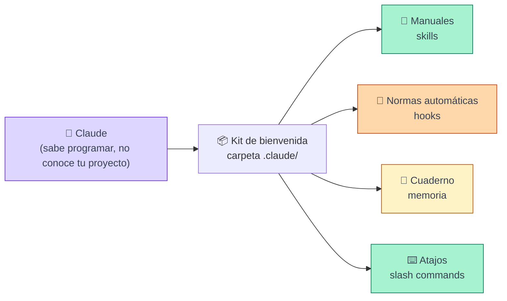
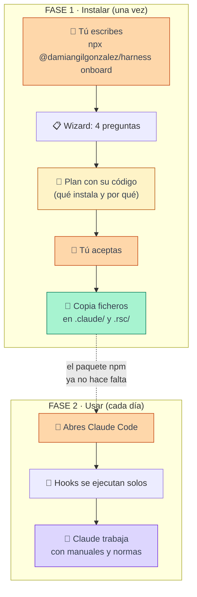
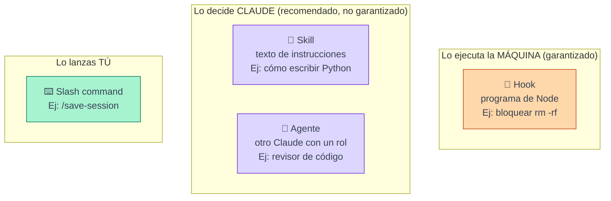
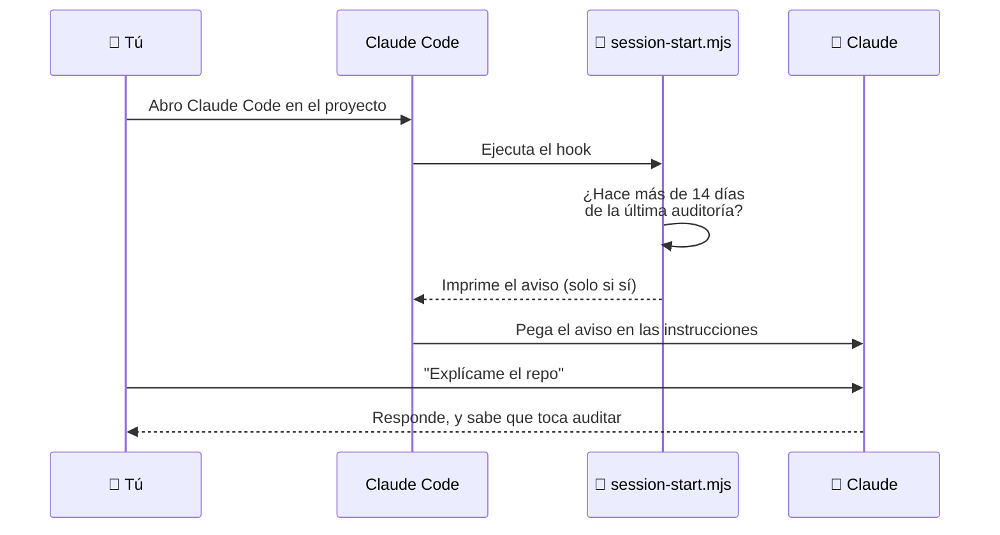
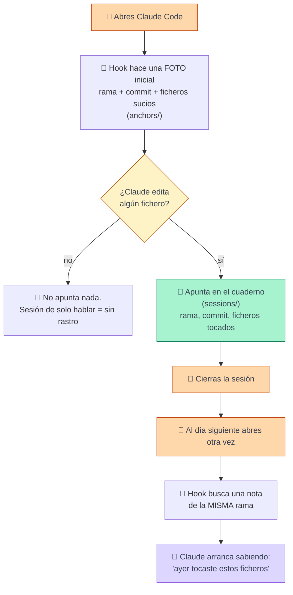
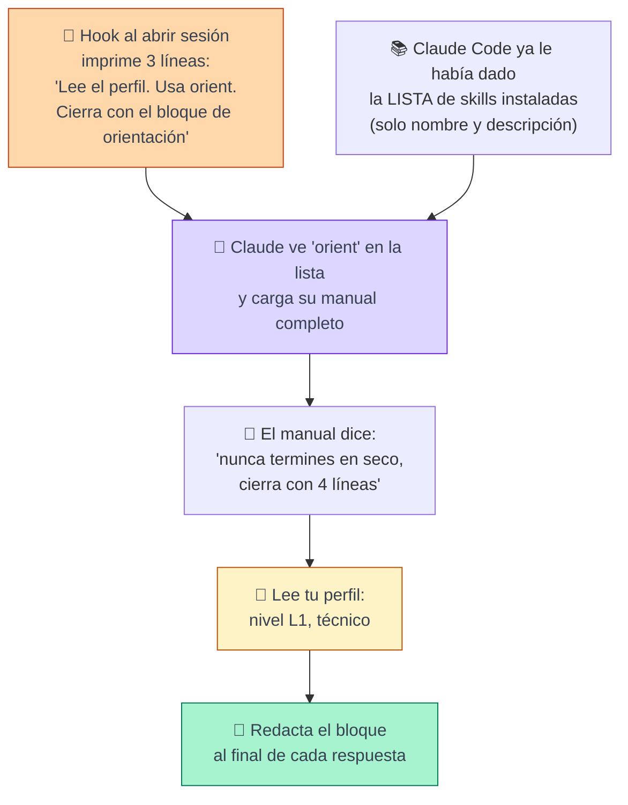
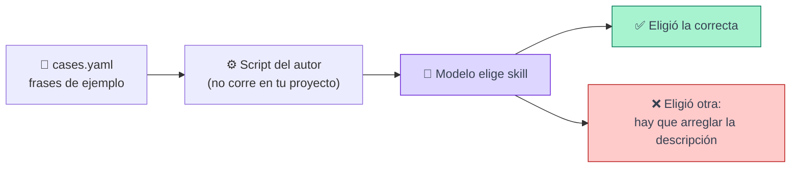
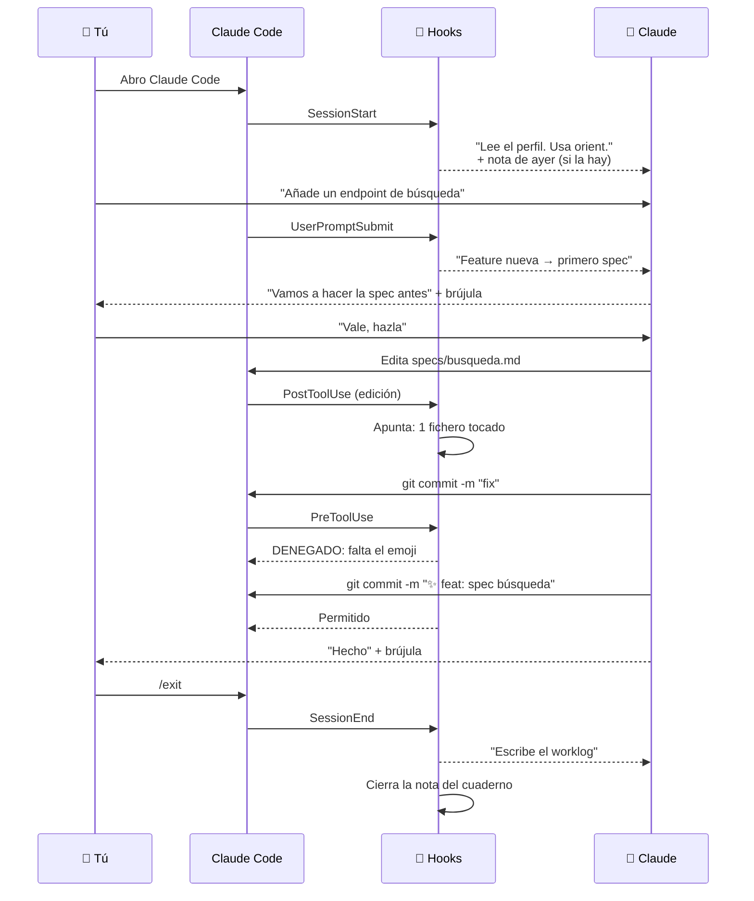

# El harness rsc explicado para cualquiera

Este documento explica qué hace `rsc-harness` cuando lo instalas en un proyecto y trabajas con Claude Code. Sin tecnicismos. Cada sección tiene un dibujo y un ejemplo.

Todo lo que se cuenta aquí se comprobó en dos proyectos reales en Windows los días 7 y 8 de septiembre de 2026.

---

## 1. La idea en una imagen

Claude es un becario muy listo que llega a tu empresa el primer día. No conoce tu proyecto, no tiene normas, y puede meter la pata. Un **harness** es el kit de bienvenida: manual, normas, un cuaderno para apuntar lo que hizo y un supervisor que le frena antes de hacer algo peligroso.

`rsc` es el que prepara ese kit y lo deja en la carpeta `.claude/` de tu proyecto.



---

## 2. Dos momentos distintos: instalar y usar

Esto es lo que más confunde. Hay dos fases y en cada una trabaja gente distinta.



**Fase 1** es un programa normal, como instalar cualquier aplicación. No usa inteligencia artificial. Hace preguntas, mira qué ficheros hay en tu carpeta (si ve `pyproject.toml` sabe que es Python) y copia ficheros. Guarda un recibo en `.rsc.json` con tus respuestas.

**Fase 2** es tu trabajo diario. Aquí ya no interviene el instalador. Solo Claude Code, los ficheros copiados y tú.

---

## 3. Quién ejecuta cada cosa

En el kit hay cuatro tipos de piezas. La diferencia clave es **quién las pone en marcha**.

| Pieza | Quién la lanza | Cuándo | ¿Puede fallar en obedecer? |
|---|---|---|---|
| **Hook** | Claude Code, solo | Al ocurrir un evento: abrir sesión, enviar mensaje, ejecutar comando, cerrar | No. Es un programa. Siempre corre. |
| **Skill** | Claude decide | Cuando cree que aplica a tu petición | Sí. Es un texto de instrucciones. |
| **Slash command** | Tú | Cuando escribes `/nombre` | Es un texto que le das a Claude. |
| **Agente** | Claude decide | Para delegar una subtarea (revisar, depurar) | Sí. Es otro Claude con instrucciones. |



Regla para recordar: **los hooks garantizan, las skills sugieren.**

---

## 4. Qué es un hook, con un ejemplo

Un hook es un programa que Claude Code ejecuta cuando pasa algo. Lo que ese programa **imprime por pantalla**, Claude Code se lo pega a Claude como si fuera una instrucción.

Ejemplo real. Cada vez que abres Claude Code en el proyecto, se ejecuta `session-start.mjs`. Ese programa mira si hace más de 14 días que no se revisa la lista de skills. Si es así, imprime esto:

```
===== rsc skill audit =====
A skill audit is due (runs at most every 14 days).
ACTION: run `npx @damiangilgonzalez/harness audit`.
===========================
```

Y Claude lo lee como parte de sus instrucciones. Si no han pasado 14 días, no imprime nada y Claude no ve nada.



Hay tres hooks que **inyectan texto** así, y tres que **bloquean** comandos. Los que bloquean (solo en proyectos grandes) responden "denegado" y Claude Code cancela el comando antes de ejecutarlo.

| Hook | Momento | Qué hace |
|---|---|---|
| session-start | Al abrir | Le dice a Claude que lea tu perfil y le pasa avisos pendientes |
| userprompt-gate | En cada mensaje tuyo | Le recuerda: "feature nueva pasa por spec antes de código" |
| worklog-checkpoint | Al cerrar | Le pide que apunte qué hizo en la sesión |
| danger-guard | Antes de cada comando | Bloquea `rm -rf`, `push --force`, `reset --hard` |
| gitmoji-guard | Antes de cada commit | Bloquea commits sin emoji al principio |
| ship-guard | Antes de cambiar de rama | Bloquea salir de tu rama con cambios sin guardar |
| session-memory | En 7 momentos | Apunta en el cuaderno (ver sección 5) |

---

## 5. La memoria, de una vez por todas

### Qué NO es

No es memoria de conversación. Claude **no recuerda lo que hablasteis ayer**. Eso no existe en ningún sitio.

### Qué SÍ es

Un cuaderno donde, al terminar la sesión, se apunta una sola cosa: **qué ficheros tocaste y en qué rama**. Al día siguiente, Claude arranca leyendo esa nota.

Ejemplo real de lo que quedó apuntado tras una sesión de prueba:

```
rama: docs/cloud-deployment
commit: b34ac893
ficheros tocados: NOTAS_PRUEBA.md, rag-api/pyproject.toml, ... (26 en total)
commits hechos: ninguno
```

Ni una línea de conversación. Ni el contenido de los ficheros. Solo nombres.

### Cómo funciona paso a paso



### Los siete momentos en que el hook mira

El mismo programa, `session-memory-adapter.mjs`, se ejecuta siete veces en distintos momentos. Cada vez compara el estado actual con la foto inicial.

| Momento | Qué hace el hook |
|---|---|
| Al abrir | Hace la foto inicial. Si hay nota de ayer, se la pasa a Claude. |
| Cada mensaje tuyo | Anota que hubo actividad. |
| Cada vez que Claude edita un fichero | Suma uno al contador de ediciones. |
| Cada comando de terminal | Vuelve a mirar git por si hubo commit. |
| Cada respuesta terminada | Si hubo trabajo, actualiza la nota. |
| Antes de resumir el contexto | Idem. |
| Al cerrar | Marca la nota como completada. |

### Por qué "no vi nada" la primera vez

Porque la regla es **sin trabajo, sin nota**. Si abres Claude Code, preguntas cosas y cierras, no hay ningún fichero tocado y el cuaderno se queda vacío. Es correcto. Solo verás la carpeta `.rsc/memory/sessions/` llena cuando Claude haya editado algo.

### Lo que Claude NO sabe al arrancar

La nota dice *qué* ficheros tocaste, no *por qué* ni *si funcionaba*. Por eso, en la prueba real, Claude leyó la nota y luego lanzó los tests por su cuenta para saber en qué estado estaba. Si quieres que la próxima sesión arranque sabiendo eso, tienes dos herramientas:

- `/learn "los tests pasan tras el rewrite"` guarda una lección corta que también se inyecta al arrancar.
- El worklog que pide el hook de cierre: Claude escribe un resumen en `docs/raw/worklog/`.

### Aviso para Windows

Tal como viene el paquete, en Windows los hooks de memoria se ejecutan pero **no escriben nada**, por un fallo de una línea al comparar rutas. Lo mismo le pasa a `gitmoji-guard`. En Mac y Linux funciona. El arreglo es cambiar en `session-memory-adapter.mjs` y `gitmoji-guard.mjs` esta línea:

```js
if (import.meta.url === `file://${process.argv[1]}`) {
```

por esta:

```js
import { pathToFileURL } from 'node:url';
if (import.meta.url === pathToFileURL(process.argv[1]).href) {
```

Tras el arreglo, una sesión real de Claude Code dejó la nota y la siguiente sesión la leyó. Comprobado.

---

## 6. La brújula: por qué Claude termina siempre con una pregunta

Si instalas el harness y pides algo, verás que Claude cierra cada respuesta con un pie parecido a este:

```
📍 Dónde estás: rama docs/cloud-deployment, harness recién instalado
✅ Qué acabo de hacer: creado NOTAS_PRUEBA.md
🧭 Por qué: fichero de prueba para verificar la memoria
➡️ Siguiente: ¿hago commit o lo dejo así?
```

Eso se llama **bloque brújula**. La pregunta es: ¿quién lo escribe?

**Lo escribe Claude, porque una skill se lo pide.** No hay ningún hook que lo añada. Es la cadena de la siguiente figura.



### El "dial": cuánto explica

Tu perfil, en `docs/wiki/harness/user-profile.md`, tiene un nivel de acompañamiento. Controla cuánto se extiende el bloque:

| Nivel | Cómo cierra Claude |
|---|---|
| L0 | Solo ✅ y ➡️. Una opción. Pregunta de sí o no. |
| L1 | Las cuatro líneas, una frase cada una. |
| L2 | Las cuatro líneas, justificando la decisión y ofreciendo alternativas. |
| L3 | Todo explicado en detalle, con varias preguntas de orientación. |

Experimento para clase: cambia `L1` por `L3` en ese fichero, abre una sesión nueva y pide lo mismo. El tono cambia sin tocar código.

### Lo importante

Como es una instrucción de texto y no un programa, Claude **puede olvidarla** en una sesión muy larga. Por eso el autor puso un hook que repite en cada mensaje la regla de "spec antes de código", que consideró más importante. La brújula no tiene ese refuerzo.

---

## 7. Qué es `evals/cases.yaml` dentro de cada skill

Cada skill trae una carpeta `evals/` con un fichero `cases.yaml`. Es la **hoja de examen** de esa skill.

Contiene frases de ejemplo de un usuario, divididas en dos listas:

- `should_trigger`: frases con las que la skill **debería** activarse.
- `should_not_trigger`: frases con las que **no** debería, y a qué otra skill le toca.

Ejemplo real de la skill `orient`:

```yaml
should_trigger:
  - prompt: "No sé por dónde seguir con mi proyecto."
    why: "El usuario está perdido: hay que situarlo y proponer el siguiente paso."

should_not_trigger:
  - prompt: "Arregla el test que falla."
    route_to: "debug"
    why: "Es una tarea concreta de otra skill."
```

**Para qué sirve.** El autor del catálogo tiene scripts que cogen esas frases, se las pasan a un modelo con las skills instaladas, y comprueban si eligió la skill correcta. Así detecta skills que se activan cuando no deben o que se pisan entre sí.

**Para ti** no hace nada en el día a día. Claude no lo lee al trabajar. Pero es muy útil para entender una skill: leer sus casos te dice en diez segundos para qué está pensada y para qué no.



---

## 8. Un día completo, de principio a fin

Para cerrar, una sesión típica con todo junto.



Mañana, al abrir, la nota del cuaderno le dirá a Claude que ayer tocaste `specs/busqueda.md` e hiciste un commit. Y empezará por ahí.

---

## 9. Los cuatro niveles de la brújula, con la misma tarea

Le pides: "crea un fichero NOTAS.md con tres líneas". Claude lo crea y **cierra** así según el nivel del perfil:

**L0** (cavernícola)
```
✅ Creado NOTAS.md.
➡️ ¿Hago commit? (sí/no)
```

**L1** (breve)
```
📍 Rama docs/cloud-deployment, sin cambios pendientes de commit.
✅ Creado NOTAS.md con tres líneas.
🧭 Lo dejé sin commit porque me lo pediste así.
➡️ ¿Hago commit o lo dejo?
```

**L2** (explica decisiones)
```
📍 Rama docs/cloud-deployment. Tienes 18 ficheros modificados de antes, sin commitear.
✅ Creado NOTAS.md con tres líneas.
🧭 Lo puse en la raíz y no en docs/ porque docs/ está en el .gitignore y se perdería.
   No hice commit porque mezclaría este fichero con tus 18 cambios pendientes.
➡️ Opciones: (a) commit solo de NOTAS.md, (b) commit de todo, (c) dejarlo. ¿Cuál?
```

**L3** (acompañamiento total)
```
📍 Estás en la rama docs/cloud-deployment. Una rama es una copia de trabajo separada
   de la principal, para no romper nada mientras pruebas. Tienes 18 ficheros tocados
   que aún no has guardado en el historial.
✅ He creado NOTAS.md en la carpeta raíz con tres líneas de texto.
🧭 Elegí la raíz porque la carpeta docs/ está marcada como "ignorada" en git, y lo
   que va ahí no se guarda en el historial. No he hecho commit (guardar en el
   historial) porque se mezclaría con tus otros 18 cambios y luego cuesta separarlos.
➡️ Puedes: (a) guardar solo este fichero, que es lo más limpio; (b) guardarlo todo
   junto, rápido pero desordenado; (c) no guardar nada aún. ¿Quieres que te explique
   qué es un commit antes de decidir, o elegimos ya?
```

El nivel se cambia hablando. Si dices "explícame menos", Claude edita el perfil y baja un nivel desde ese turno. El nivel técnico del perfil es independiente: un usuario técnico en L3 recibe todo el razonamiento pero sin explicarle qué es un commit.

---

## 10. Para qué sirven las skills, agrupadas por lo que harías tú

Las skills son los manuales del becario. Se activan solas cuando tu petición encaja con su descripción. Tú no las llamas. Un proyecto grande recibe unas 34; estas son las familias:

**Cuando quieres construir algo nuevo**, en este orden. Primero se aclara *qué*, después se escribe, y solo entonces se programa:

| Skill | Ejemplo de lo que hace |
|---|---|
| `grill-with-docs` | "Quiero un buscador" → te interroga hasta que el qué y el cómo están claros, y va dejando las decisiones por escrito. |
| `wayfinder` | Para trabajo que no cabe en una sesión: levanta un mapa de decisiones antes de tocar nada. |
| `to-spec` | Recoge la conversación y la convierte en una spec publicada. |
| `write-adr` | Registra en `docs/adr/` cada decisión difícil de revertir, con las alternativas que se descartaron. |
| `superpowers:writing-plans` | Convierte la spec en un plan con pasos pequeños, cada uno con su test. |
| `superpowers:executing-plans` | Ejecuta ese plan, parando a revisar entre tareas. |
| `to-tickets` + `implement` | La vía alternativa cuando el trabajo es enorme: se parte en tickets y se hacen de uno en uno. |
| `revision-de-cambios` | Revisa lo programado contra lo que pedía la spec. |

Ese orden no es una sugerencia: el harness lo inyecta como regla en cada mensaje que escribes. Lo único exento es un cambio de una línea o un typo, y Claude tiene que decirte que se salta la cadena.

**Cuando algo falla**: `superpowers:systematic-debugging` obliga a reproducir el error y probar la causa antes de tocar nada.

**Cuando programas en tu stack**: `python`, `react`, `nextjs`, `ui-engineering`. Normas de estilo para que el código salga como lo haría un senior de ese lenguaje. Se instalan solo las de tu stack.

**Cuando quieres que te lo expliquen**: `eli5` (como a un niño), `show-me` (con un esquema en vez de texto), `bro` (respuesta corta y directa).

**Cuando escribes texto**: `unslop` quita las muletillas típicas de IA de un documento.

**Las que gestionan el propio kit**: `orient` (la brújula), `suggest` (propone skills que faltan), `init` (primer contacto), `harness` (organiza la carpeta `docs/`).

Aclaración frecuente: el aviso de "CLAUDE.md demasiado largo" **no es una skill**. Es una de las nueve comprobaciones del hook de arranque. Cuenta las líneas de `CLAUDE.md` y, si pasan de 200, le dice a Claude que mueva el contenido a la wiki. Si tu proyecto no tiene `CLAUDE.md`, nunca aparece.

---

## 11. Doctor y repair, con ejemplo

`rsc doctor` es la revisión médica del kit. Lo lanzas tú en la terminal cuando algo va raro. No toca nada, solo informa.

Ejemplo típico: un compañero clona tu repo, abre Claude Code y no pasa nada. Ejecuta `doctor` y le dice: "settings.json menciona `.rsc/session-start.mjs` pero ese fichero no existe; ejecuta `rsc sync`". Eso pasa porque `.claude/settings.json` va en git pero `.rsc/` no. Sin `doctor`, se quedaría sin saber por qué el harness no arranca.

También te dice cuánto contexto gasta el kit por sesión y por mensaje, y qué skills pesan más.

`rsc repair` arregla lo que `doctor` encontró, con una regla: lo que solo devuelve el kit a como estaba (un enlace roto, un hook duplicado) lo hace solo tras un backup. Lo que cambiaría una decisión tuya (otra herramienta, desactivar un guarda) lo pregunta uno a uno.

---

## 12. Línea de tiempo de una sesión, hook a hook

Esta es la configuración real de un proyecto grande (aurora). Cada momento dispara varios hooks, siempre en el mismo orden. Hay dos tipos: los que **inyectan** texto a Claude (naranja) y los que **apuntan** en el cuaderno sin que Claude vea nada (gris). Los guardas (rojo) pueden **bloquear**.

```mermaid
flowchart TD
    t0["⏱ MOMENTO 0 · Abres Claude Code"]:::trigger
    t0a["🚧 session-start.mjs<br>inyecta el manual de suggest completo<br>+ avisos pendientes (auditoría, versión...)"]:::inject
    t0b["📓 memory · start<br>hace la foto inicial de git<br>y si hay nota de ayer, la inyecta"]:::memo

    t1["⏱ MOMENTO 1 · Escribes un mensaje"]:::trigger
    t1a["🚧 userprompt-gate.mjs<br>inyecta: 'feature nueva → spec primero'"]:::inject
    t1b["📓 memory · request<br>apunta actividad"]:::memo

    t2["⏱ MOMENTO 2 · Claude va a ejecutar un comando"]:::trigger
    t2a["🛡 ship-guard<br>¿sales de tu rama con cambios? → BLOQUEA"]:::guard
    t2b["🛡 danger-guard<br>¿rm -rf, push --force? → BLOQUEA<br>(solo si tu perfil no es técnico)"]:::guard
    t2c["🛡 gitmoji-guard<br>¿commit sin emoji? → BLOQUEA"]:::guard
    t2d["▶ El comando se ejecuta<br>(si nadie bloqueó)"]
    t2e["📓 memory · boundary<br>vuelve a mirar git por si hubo commit"]:::memo

    t3["⏱ MOMENTO 3 · Claude edita un fichero"]:::trigger
    t3a["📓 memory · edit<br>suma 1 al contador de ediciones"]:::memo

    t4["⏱ MOMENTO 4 · Claude termina su respuesta"]:::trigger
    t4a["📓 memory · turn<br>si hubo trabajo, escribe la nota"]:::memo
    t4b["🧭 Claude cierra con la brújula<br>(no es un hook: lo decide él)"]:::ai

    t5["⏱ MOMENTO 5 · El contexto se llena y se resume"]:::trigger
    t5a["🚧 worklog-checkpoint.mjs<br>inyecta: 'apunta qué hiciste'"]:::inject
    t5b["📓 memory · compact<br>actualiza la nota"]:::memo

    t6["⏱ MOMENTO 6 · Cierras con /exit"]:::trigger
    t6a["🚧 worklog-checkpoint.mjs<br>inyecta: 'apunta qué hiciste'"]:::inject
    t6b["📓 memory · end<br>marca la nota como completada"]:::memo

    t0 --> t0a --> t0b --> t1
    t1 --> t1a --> t1b --> t2
    t2 --> t2a --> t2b --> t2c --> t2d --> t2e --> t3
    t3 --> t3a --> t4
    t4 --> t4a --> t4b
    t4b -. "otro mensaje" .-> t1
    t4b -. "sesión larga" .-> t5
    t5 --> t5a --> t5b -.-> t1
    t4b -. "terminas" .-> t6
    t6 --> t6a --> t6b

    classDef trigger fill:#fed7aa,stroke:#c2410c,color:#374151
    classDef inject fill:#fef3c7,stroke:#b45309,color:#374151
    classDef memo fill:#e5e7eb,stroke:#6b7280,color:#374151
    classDef guard fill:#fecaca,stroke:#b91c1c,color:#374151
    classDef ai fill:#ddd6fe,stroke:#6d28d9,color:#374151
```



### La misma línea de tiempo en tabla

| Momento | Evento de Claude Code | Qué corre, en orden | Claude ve |
|---|---|---|---|
| 0. Abres | SessionStart | `session-start.mjs`, luego `memory start` | El manual de suggest, los avisos, y la nota de ayer si existe |
| 1. Escribes | UserPromptSubmit | `userprompt-gate.mjs`, luego `memory request` | La regla "spec antes de código" |
| 2. Comando de terminal | PreToolUse (Bash) | `ship-guard`, `danger-guard`, `gitmoji-guard` | Nada, salvo que uno bloquee: entonces ve el motivo |
| 2b. Comando terminado | PostToolUse (Bash) | `memory boundary` | Nada |
| 3. Edita un fichero | PostToolUse (Edit, Write) | `memory edit` | Nada |
| 4. Termina la respuesta | Stop | `memory turn` | Nada |
| 5. Se resume el contexto | PreCompact | `worklog-checkpoint.mjs`, luego `memory compact` | "Apunta qué hiciste" |
| 6. Cierras | SessionEnd | `worklog-checkpoint.mjs`, luego `memory end` | "Apunta qué hiciste" |

Los momentos 1 a 4 se repiten en cada vuelta de la conversación. El 5 solo ocurre en sesiones largas. El 6 una vez.

### Los slash commands no están en la línea

Porque no los dispara ningún evento: los lanzas tú cuando quieres. Los diez de un proyecto grande:

| Command | Lo que le pide a Claude |
|---|---|
| `/save-session` | Escribe la nota del cuaderno ahora, aunque no haya cambios |
| `/resume-session` | Lee la nota de esta rama y cuéntame dónde me quedé |
| `/learn "texto"` | Guarda una lección corta que se inyectará al arrancar, previa aprobación |
| `/checkpoint` | Congela el código para revisión (sistema "sello", desactivado por defecto) |
| `/python-review`, `/react-review`, `/nextjs-review` | Lanza el agente revisor de ese stack sobre el código actual |
| `/react-build`, `/nextjs-build`, `/build-fix` | Lanza el agente que arregla errores de compilación |

### Un detalle que cambia entre proyectos

En el proyecto pequeño, el hook de arranque inyectaba un fichero corto de tres líneas. En el proyecto grande inyecta el manual completo de `suggest`, unas 130 líneas, porque ahí sí están instaladas las skills a las que ese manual apunta (`grill-with-docs`, `to-spec`). Es el mismo hook; cambia el fichero que le pasan como argumento en `settings.json`.

---

## Chuleta final

- **Instalar** es un programa sin IA. **Usar** es Claude con el kit.
- **Hook** = lo ejecuta la máquina, siempre. **Skill** = lo decide Claude, casi siempre.
- **Memoria** = solo nombres de ficheros y rama. Nunca conversación. Solo si hubo edición.
- **Brújula** = Claude cierra con cuatro líneas porque una skill se lo pide. Tu perfil decide cuántas.
- **cases.yaml** = examen de la skill. No corre en tu proyecto.
- **Windows** = memoria y gitmoji-guard necesitan el parche de una línea.
