# 1 · Planificar

Todo lo que pasa **antes de escribir código**. Sale una spec y un plan, no una idea.

Sigue el método *spec-driven development*: la fuente de verdad es un documento escrito, no un
mensaje de chat. Las fases de bajar a tierra, especificar, aclarar y planificar caen todas aquí.



---

## `claude-project-setup` — una vez por proyecto

Equivale a la **constitución**: los principios que gobiernan el proyecto. Inicializa
`CLAUDE.md`, reglas, comandos y agentes.

No se repite en cada tarea. Se hace al abrir el repo y se retoca cuando cambian las
convenciones.

---

## Bajar a tierra: `grill-with-docs` o `wayfinder`

La primera pregunta es si el trabajo **cabe en una sesión**.

### `grill-with-docs` — lo normal

**Cuándo.** Una idea verde, una pregunta abierta, o un plan entero que nadie ha atacado.

**Qué hace.** Interroga el plan sin tregua y **va escribiendo el glosario** mientras lo hace.
Es `grilling` + `domain-modeling`, y es la que conviene usar por defecto: una sesión de
`grilling` a secas resuelve el plan y se evapora.

> `grilling`, `grill-me` y `domain-modeling` están instaladas pero no hace falta invocarlas: la
> primera va dentro de `grill-with-docs`, la segunda es un atajo, y la tercera la usa
> `grill-with-docs`.

### `wayfinder` — solo si no cabe en una sesión

**Cuándo.** El esfuerzo es grande: varios días, varias personas, algo que atraviesa media
aplicación.

**Qué hace.** Convierte el trabajo en un mapa de tickets de **decisión**, no de tareas. Cada
ticket es una pregunta que hay que cerrar, y se resuelven de uno en uno. El tracker son GitHub
Issues.

**Qué viene después.** El trabajo que sale de `wayfinder` se construye con `to-tickets` →
`implement`, ticket a ticket, en vez de con un plan de superpowers.

```
/wayfinder

Quiero rehacer el sistema de notificaciones.
```

---

## Cerrar un hueco: tres caminos según qué falte

Mientras bajas la idea a tierra aparecen huecos. Una spec con huecos produce código con huecos.
Cuál usar depende de **por qué** está el hueco:

| El hueco es… | Skill |
|---|---|
| Un dato que no sé y está documentado en algún sitio | `research` |
| Algo que no puedo saber yo: lo sabe el cliente, el comercial, producto | `to-questionnaire` |
| Una decisión de diseño que no se resuelve discutiendo, hay que verla | `prototype` |

Los tres **vuelven al interrogatorio** y, al final, a la spec. No son fases sueltas: son maneras
de cerrar un hueco para poder escribir el documento.

### `research`

Investiga contra fuentes primarias y deja el hallazgo como Markdown en el repo, fechado. La
próxima vez que surja la duda, la respuesta ya está.

### `to-questionnaire`

Convierte la decisión en un cuestionario en Markdown para que lo rellene quien sí sabe. Evita el
bloqueo de "esto no lo sé" y su alternativa mala, que es decidirlo tú y descubrir en la demo que
estaba mal.

### `prototype`

Prototipo **desechable** para responder una pregunta concreta de diseño. Si acaba en producción,
no era un prototipo.

---

## Escribir la spec: `superpowers:brainstorming` o `to-spec`

**Cuándo.** Ya está claro qué quieres construir. Antes de tocar código.

**Qué hace.** Convierte la idea en una spec: qué se construye, qué queda fuera, qué
comportamiento se espera y qué decisiones están cerradas.

| Skill | Cuándo |
|---|---|
| `superpowers:brainstorming` | Quieres cerrar el diseño por partes, aprobando cada sección. Deja la spec en `docs/superpowers/specs/`. |
| `to-spec` | Ya está todo hablado. Pasa a limpio lo decidido sin volver a preguntar. |

**Por qué importa.** Una spec escrita es lo que permite revisar después si lo construido es lo
pedido. Sin ella, "está terminado" es una opinión.

```
/to-spec

Los técnicos tienen que poder anotar la solución desde el móvil, con foto,
y que eso cierre la incidencia.
```

**Sale de aquí:** un fichero en el repo, no un mensaje en el chat.

---

## `write-adr` — cada decisión difícil de revertir

**Cuándo.** Aparece una decisión que costaría deshacer: una base de datos, un formato, una
frontera entre módulos, una dependencia.

**Qué hace.** Escribe un ADR en `docs/adr/ADR-NNN-titulo.md`, con el contexto, las alternativas
descartadas y las consecuencias. Si existe `docs/adr/README.md`, sigue su numeración y formato.

**Por qué importa.** Dentro de seis meses nadie recuerda por qué se eligió X. Sin el ADR, la
decisión se vuelve a discutir, o peor, se deshace sin saber el motivo.

---

## Planificar: `superpowers:writing-plans`

**Cuándo.** Tienes la spec aprobada.

**Qué hace.** Convierte la spec en un plan de tareas pequeñas, cada una con su test, en
`docs/superpowers/plans/`. Es lo que después ejecuta `superpowers:executing-plans`.

---

## `to-tickets` — trocear, cuando vienes de `wayfinder`

Descompone el trabajo en tickets accionables, cada uno resoluble de una sentada y revisable de un
vistazo. Es lo que evita el PR de cuarenta ficheros.

**Separa lo que se ve de lo que no.** Una tarea que junta endpoint y pantalla se revisa mal:
mezcla criterios de correctitud con criterios de interfaz. Pártela, y deja cerrado el contrato de
la API antes de tocar la pantalla.

---

**Siguiente:** [2 · Implementar](2-implementar.md) · **Índice:** [README](README.md)
