# 2 · Implementar

Aquí el trabajo ya está decidido en la spec y lo que queda es ejecutarlo. Si la tarea toca
interfaz, pasa además por [la cadena de interfaz](3-interfaz.md).



---

## Dos puntos de entrada

| Llegas con… | Skill |
|---|---|
| Un plan de `superpowers:writing-plans` | `superpowers:executing-plans`, tarea a tarea, parando a revisar entre ellas. Si prefieres repartir las tareas entre subagentes en la misma sesión, `superpowers:subagent-driven-development`. |
| Un ticket de `to-tickets` (vienes de `wayfinder`) | `implement` |

## `implement`

**Cuándo.** Tienes un ticket de `to-tickets`.

**Qué hace.** Ejecuta la implementación de ese ticket. Uno, no varios.

```
/implement

Ticket #42.
```

---

## Siempre con TDD

Da igual la vía: `superpowers:test-driven-development`. Primero el test que falla, después el
código que lo hace pasar.

Antes de decir que algo está hecho, `superpowers:verification-before-completion`: ejecutar las
comprobaciones y enseñar la salida. "Debería funcionar" no es una prueba.

---

## Una tarea, una sesión

La tentación es encadenar tareas en la misma conversación. Aguanta lo que aguanta: según crece
el contexto, el modelo empieza a mezclar decisiones de una tarea con las de la siguiente.

Si vas a encadenar muchas, puedes cerrar con `handoff` y abrir sesión nueva. No es obligatorio.

---

## Cuando aparece algo que la spec no contempla

Tres casos, y se resuelven distinto:

| Qué ha aparecido | Qué hacer |
|---|---|
| No sé cómo se comporta una herramienta externa | `research`, y sigues |
| Algo falla y no sé por qué | `superpowers:systematic-debugging`: reproducir y probar la causa antes de tocar nada |
| Es una decisión de producto | **Para.** Vuelve a la spec y actualízala |

El tercero es el que se hace mal: se decide sobre la marcha, no queda escrito, y en la revisión
nadie puede comprobar si era lo pedido.

---

## El contrato de la API es la frontera

Si esta tarea alimenta una pantalla, el contrato es lo que el frontend va a dar por hecho. Déjalo
cerrado y escrito antes de pasar a la interfaz: cambiarlo después significa rehacer las dos
mitades.

**Siguiente:** [3 · Interfaz](3-interfaz.md) si toca pantalla, o
[4 · Revisar y cerrar](4-revisar-y-cerrar.md) · **Índice:** [README](README.md)
