# 3 · Interfaz

Dieciséis skills, y ese es el problema: se solapan. Este documento existe para que no tengas que
leerlas todas para saber cuál toca.

**El orden, en una línea:** qué dice → cómo se ve → cómo se mueve → pulido → originalidad →
psicología.

---

## Paso 1 · Dirección

Elige **una** de estas dos, no las dos:

| Construyes | Skill | Por qué esa |
|---|---|---|
| Una landing | `diseno-landing` | La única que habla de negocio: una oferta, objeciones, FAQ, reversión de riesgo, SEO. Su Parte B ya trae las reglas visuales. |
| Cualquier otra cosa: dashboard, prototipo, presentación, visualización | `ingeniero-diseno-web` | Dirección de arte, design system declarado, 25 recetas ancladas y puntos de control que te frenan a confirmar. |

**Para una landing no uses `ingeniero-diseno-web`.** `diseno-landing` ya la cubre entera. Se
solapan porque son de autores distintos que resolvieron lo mismo.

**Si no sabes qué aspecto quieres:** `ingeniero-diseno-web` tiene un asesor que te propone tres
escuelas distintas con referencias reales. Eliges, y vuelves.

**Para cómo se construye por dentro** (estado, componentes, formularios), `ui-engineering`, que
viene del catálogo original del harness.

---

## Paso 2 · Espectáculo, solo si toca

### `sitios-calidad-premio`

**Cuándo.** Lanzamiento de producto, portafolio, algo que tiene que impresionar. GSAP, scroll
suave, Three.js.

**Cuándo NO.** Un dashboard o una herramienta de uso diario: ahí el espectáculo es un coste que
se paga en cada uso.

Es la más cara en esfuerzo y en rendimiento. Sáltatela sin remordimiento.

---

## Paso 3 · Movimiento

### `animar`

Antes de escribir código pasa una **puerta de frecuencia**: si el usuario va a ver eso cien veces
al día, la respuesta correcta es no animarlo. Es la única skill diseñada para producir a veces
cero líneas de código.

### `diseno-apple`

Solo si hay gestos, arrastre u hojas deslizantes. Añade muelles con física real,
interrumpibilidad y traspaso de velocidad: lo que separa "correcto" de "fluido". Para un fundido o
un hover no la necesitas.

### Dos utilidades que no construyen nada

- `vocabulario-animacion` — le describes un efecto y te da su nombre exacto, para poder pedirlo
  bien.
- `video-a-superprompt` — le pasas la grabación de una web y te devuelve el prompt de recreación.
  Necesita `ffmpeg`.

---

## Paso 4 · Pulido

Las seis `mejor-*` son reglas concretas con valores exactos, y no se pisan:

| Skill | Su terreno |
|---|---|
| `mejor-layout` | Agrupación, alineación, orden de lectura, breakpoints, RTL |
| `mejor-tipografia` | Escala, interlineado, wrapping, truncado, puntuación |
| `mejor-colores` | Rampas, tokens, contraste medido, modo oscuro |
| `mejor-accesibilidad` | Foco, teclado, ARIA, áreas de pulsación, formularios |
| `mejor-ui` | Radios, alineación óptica, superficies, iconos, escala al pulsar |
| `mejor-redaccion` | Textos de botón, errores, estados vacíos, voz y tono |

**No las invoques a mano una a una.** Usa `revision-interfaz`, que las orquesta en orden y
consolida un único informe. Una suelta, solo para una duda puntual de su terreno.

---

## Paso 5 · Que no parezca de IA

### `tastemaker`

Va después del pulido porque necesita algo que auditar, y **antes** que las leyes porque cambia
estructura, no solo detalles.

Mide el color de píxeles reales, genera la paleta en vez de elegirla de una lista, y rota la
forma de página contra lo que construiste la vez anterior. Tiene un **modo auditar** que no toca
nada.

**Necesita Python.** Sin sus scripts pierde lo que la hace distinta.

---

## Paso 6 · Psicología

### `leyes-de-percepcion`

Gestalt aplicada: proximidad, similitud, región común, cierre, continuidad, figura-fondo, Von
Restorff, jerarquía. Trae un diagnóstico de seis puntos que se pasa en dos minutos.

### `leyes-de-retencion`

Nueve leyes, una por cada clase de abandono. Su tabla síntoma → ley es lo más rentable de las
dieciséis:

| Síntoma | Ley |
|---|---|
| Se queda parado sin elegir | Hick |
| Falla el objetivo en móvil | Fitts |
| Se pierde a mitad del formulario | Miller |
| No encuentra algo que está a la vista | Jakob |
| Se va durante la espera | Doherty |
| Empieza y no vuelve | Zeigarnik |
| Se salta lo del medio de una lista | Posición serial |
| Lo completa pero lo recuerda mal | Pico-final |
| Todo parece simple y aun así sufre | Tesler |

---

## Atajos

| Situación | Cadena |
|---|---|
| Landing nueva | `diseno-landing` → `animar` → `revision-interfaz` |
| Dashboard nuevo | `ingeniero-diseno-web` → `revision-interfaz` |
| Pantalla que "parece de IA" | `tastemaker` (auditar) → `leyes-de-percepcion` |
| Un flujo pierde usuarios | `leyes-de-retencion` → `mejor-redaccion` → `mejor-accesibilidad` |
| Solo pulir lo que hay | `revision-interfaz` |

**Siguiente:** [4 · Revisar y cerrar](4-revisar-y-cerrar.md) · **Índice:** [README](README.md)
