# 4 · Revisar y cerrar

El camino depende de si el trabajo ha tocado interfaz o no.



---

## `code-review` — el camino común, antes de fusionar

**Qué mira.** El código, en dos ejes independientes que corren en subagentes paralelos:

- **Estándares** — ¿sigue las convenciones documentadas del repo?
- **Spec** — ¿hace lo que pedía el issue o la spec de origen?

**Por qué los dos ejes.** Un código impecable que resuelve otra cosa pasa cualquier revisión de
estilo. El segundo eje es el que lo caza, y es el que se olvida.

```
/code-review

Desde main.
```

Si el trabajo no ha tocado interfaz, es la única que necesitas. Si la ha tocado, va la última.

---

## `revision-de-cambios` — solo si tocó interfaz, y va primero

**Qué mira.** El **cambio**, no la pantalla. Resuelve el alcance contra el merge-base, expande los
ficheros tocados a las superficies donde se renderizan, y clasifica cada hallazgo:

- `Introducido` — lo creó este cambio
- `Regresión` — debilitó algo que antes funcionaba
- `Preexistente` — ya estaba

**Por qué esa clasificación importa.** Es la diferencia entre "has roto esto" y "esto ya estaba
roto". Sin ella, tocar un fichero heredado se convierte en una auditoría que nadie pidió.

**Lo que hace y nadie más hace:** leer el lado `-` del diff. Las regresiones son invisibles
mirando solo el estado final.

**Por qué va antes que `revision-interfaz`.** Responden a preguntas distintas: esta dice si
empeoraste algo, la otra si la pantalla está bien. Empezando por la segunda te llenas el informe
de problemas que ya estaban.

```
/revision-de-cambios pr 482
```

Sin argumentos revisa lo que tengas sin commitear. Es de solo lectura.

---

## `revision-interfaz` — solo si tocó interfaz

**Qué mira.** La pantalla. Enruta a las seis `mejor-*` en orden, consolida en **una** tabla
ordenada por severidad y emite un veredicto.

**Lo que la hace fiable.** Disparadores que son ALTA a la vista, sin promediar: un control sin
nombre accesible, foco invisible, movimiento que ignora `prefers-reduced-motion`, contenido
recortado a 320px, significado transmitido solo por color.

---

## `handoff` — opcional

**Cuándo.** Al terminar, si queda trabajo a medias o se tomaron decisiones que no están en ningún
commit. No es un paso obligatorio del ciclo.

**Qué hace.** Compacta la conversación en un documento de traspaso: qué se hizo, qué se decidió y
por qué, qué queda pendiente y dónde está cada cosa.

**Cómo se usa.** Al empezar la siguiente sesión le pasas el documento y arrancas con el contexto
sin gastar la mitad del presupuesto en reconstruirlo.

**Lo que no sustituye.** Es contexto de trabajo, no memoria del proyecto. Una decisión duradera va
a un ADR con `write-adr`, no a un traspaso que se lee una vez.

---

## Resumen

| El trabajo | Orden |
|---|---|
| **No tocó interfaz** | `code-review` |
| **Tocó interfaz** | `revision-de-cambios` → `revision-interfaz` → `code-review` |

Cuando tocó interfaz el orden no es capricho: primero qué has roto, luego cómo está la pantalla,
y al final si hace lo que pedía la spec. Si queda alguna severidad ALTA, se arregla y se repite.
Después se fusiona.

**Anterior:** [2 · Implementar](2-implementar.md) o [3 · Interfaz](3-interfaz.md) ·
**Fuera del flujo:** [9 · Otras](9-otras.md) · **Índice:** [README](README.md)
