# Skills personales: el ciclo spec-driven

Guía de las 37 skills personales del catálogo: qué hace cada una, en qué fase del ciclo se usa y
en qué orden. Viene del antiguo repositorio `claude-skills`, que este harness sustituye.

Las skills viven en [`skills/`](../../skills/), junto al resto del catálogo. Sus cuerpos están en
español; solo la `description` de cada una está traducida al inglés, para que Claude decida
cuándo activarlas.

## La filosofía: spec-driven development

La fuente de verdad es un **documento escrito**, no un mensaje de chat. Primero se baja la idea a
tierra, después se escribe la spec, se planifica, se implementa y al final se revisa contra lo
especificado. Cada skill ocupa un sitio en ese ciclo.



Tres cosas hacen que funcione, y son las que más se saltan:

- **Lo que aclaras vuelve a la spec.** Aclarar no es una conversación suelta: es cerrar un hueco
  para poder escribir el documento.
- **Las decisiones difíciles de revertir quedan en un ADR** con `write-adr`, en `docs/adr/`. Una
  decisión que solo está en el chat se pierde al cerrar la sesión.
- **La revisión se hace contra la spec**, no contra el gusto de quien revisa. Si el código no
  cumple lo especificado, se vuelve a la spec, no se discute en el PR.

Siempre, en cualquier fase que toque código: `superpowers:test-driven-development` y
`superpowers:verification-before-completion` antes de dar algo por terminado. Los bugs empiezan
por `superpowers:systematic-debugging`.

## El flujo en una línea

```
grill-with-docs  o  wayfinder                 bajar la idea a tierra
        ↓
superpowers:brainstorming  o  to-spec         escribir la spec  (+ write-adr)
        ↓
superpowers:writing-plans → superpowers:executing-plans
        (si vienes de wayfinder: to-tickets → implement)
        ↓
code-review                                   estándares + spec, antes de fusionar
```

Es el mismo flujo que el harness inyecta como regla en cada mensaje (`targets/hook-once.mjs`).
Si cambias uno, cambia el otro.

---

## Las fases

| Fase | Skills | Guía |
|---|---|---|
| **1 · Planificar** | `claude-project-setup`, `grill-with-docs`, `wayfinder`, `research`, `to-questionnaire`, `prototype`, `to-spec`, `write-adr`, `to-tickets` | [1-planificar.md](1-planificar.md) |
| **2 · Implementar** | `implement` (y `superpowers:executing-plans`) | [2-implementar.md](2-implementar.md) |
| **3 · Interfaz** | Las 16 de diseño | [3-interfaz.md](3-interfaz.md) |
| **4 · Revisar y cerrar** | `code-review`, `revision-de-cambios`, `revision-interfaz`, `handoff` | [4-revisar-y-cerrar.md](4-revisar-y-cerrar.md) |
| **9 · Otras** | `teach`, `muscle-memory`, `wait-what`, `writing-for-agents` | [9-otras.md](9-otras.md) |

`grilling`, `grill-me` y `domain-modeling` están instaladas, pero no hace falta invocarlas: van
dentro de `grill-with-docs`.

Para explicar todo esto a alguien no técnico: [guia-para-clase.md](guia-para-clase.md).

---

## Instalación

Ya no hace falta clonar nada ni ejecutar un instalador. En el proyecto:

```bash
npx @damiangilgonzalez/harness@latest onboard
```

El onboarding decide el paquete según el proyecto:

| Proyecto | Recibe |
|---|---|
| Pequeño | Lo básico (`orient`, `suggest`, `harness`, `teach`…) |
| Software con entidad | Básico + todo el flujo de trabajo + el plugin superpowers declarado |
| Con interfaz (React, Next, Vue, Svelte, Angular) | Lo anterior + las 16 de diseño + `ui-engineering` |

Para añadir una skill suelta: `npx @damiangilgonzalez/harness@latest add <nombre>`.

## Los esquemas

Cada imagen de `docs/img/` se genera desde su `.mmd`. Para cambiar un esquema, edita el `.mmd` y
regenera el `.svg`:

```bash
mmdc -i docs/img/01-planificar.mmd -o docs/img/01-planificar.svg -b transparent
```
